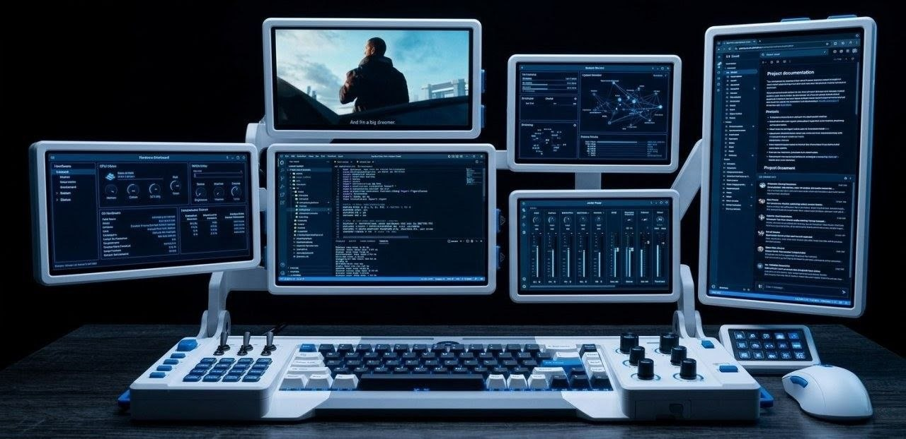
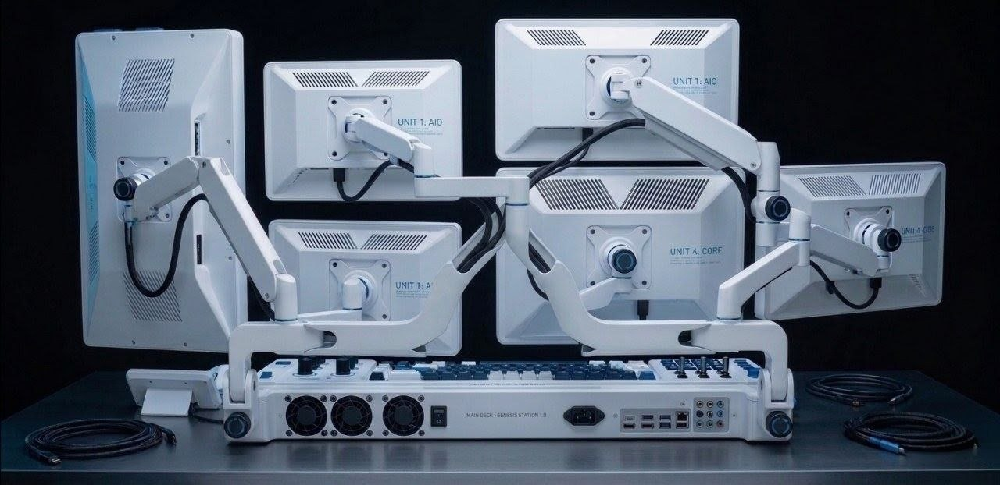
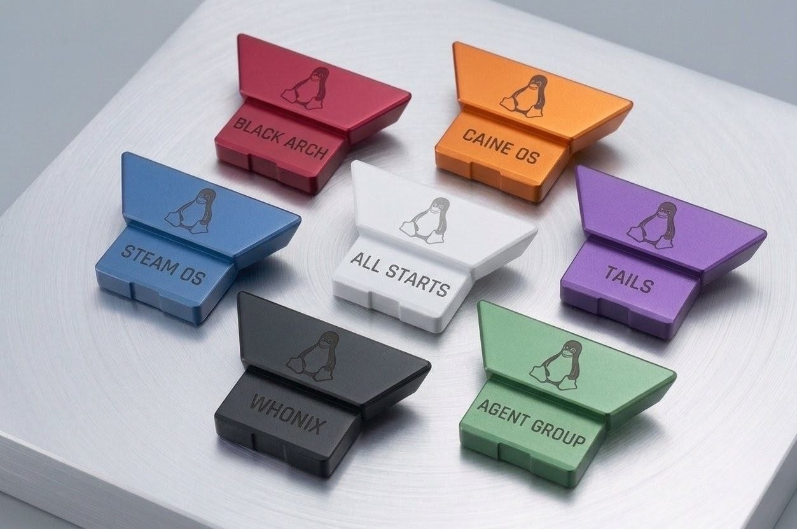

# A custom cyberdeck !!

- With the in-built AI support 

- Power stones for the instant OS & Scripts loading 

- Merged a kill switch 

- Voice- and text-based offline working AI agent 

- 6 screens and one touch screen for the agent 

- Wants to make a portable design 

- And try to make a dedicated OS for that which is backboned by the BTC and incruption

- Detachable and replaceable hardware 

- And try to make edits to stable distros (like Debian, openSUSE, and Mint) with the daily needed and secure open-source tools and easy mobile connectivity 

---

  
Click to view my design ↴ 

  
> - Yet, it's not in the portable form.

| Front side | Back side | Power Stones |
|----------|----------|----------|
|  | | |

   

---

## For reference, you can see this videos !!

  
 tap to view ↴ 

> - This project is inspired by that 2 and 100+ other videos.

| Cyberdeck | Laptop |
|---------|---------|
|  |  |   

